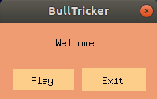

# BullTricker




# Requirements

- C compiler (gcc).
- GNU/Linux.
- SDL2 library.

# Running

compile with 'make'
```
  $ make
```
run with 'make run'

```
  $ make run
```

clean with 'make clean'
```
  $ make clean
```
# Contributing

Contributions are very welcome. 


